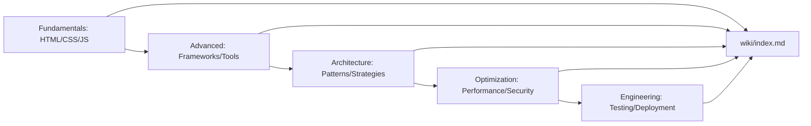

# Frontend Wiki

<div align="center">

**English** · [简体中文](README.zh-CN.md)

[](https://github.com/frontend-wiki)
[](./wiki/overview.md)

</div>

> A systematic frontend knowledge system — from fundamentals to architecture, from tools to philosophy.
> **The goal isn't to list technologies, but to understand how frontend thinks, evolves, and builds user interfaces.**

<div align="center">
  
  
  
  
  
  
</div>

This wiki adopts the **Karpathy Wiki Method**: raw materials are systematically organized and distilled into high-compression concept pages, technique pages, and pattern pages. [`wiki/overview.md`](wiki/overview.md) is the highest-compression synthesis; [`wiki/index.md`](wiki/index.md) is the full catalog.

> [!IMPORTANT]
> Start from [`wiki/overview.md`](wiki/overview.md), not the details. The overview provides the global perspective; the index provides complete navigation.

---

## Quick Paths

| I want to… | Start here |
|---|---|
| See the whole synthesis | [wiki/overview.md](wiki/overview.md) |
| Browse the full catalog | [wiki/index.md](wiki/index.md) |
| Master fundamentals | [concepts/html-fundamentals.md](wiki/concepts/html-fundamentals.md) · [concepts/css-fundamentals.md](wiki/concepts/css-fundamentals.md) · [concepts/javascript-fundamentals.md](wiki/concepts/javascript-fundamentals.md) |
| Understand modern frameworks | [concepts/component-architecture.md](wiki/concepts/component-architecture.md) |
| Learn performance optimization | [concepts/web-vitals.md](wiki/concepts/web-vitals.md) |
| Master engineering | [concepts/frontend-tooling.md](wiki/concepts/frontend-tooling.md) |

---

## 1. What is Frontend?

> "Frontend is the interface layer between users and the digital world."

Frontend development isn't "writing pages" — it's **building the medium of human-computer interaction**. Three core dimensions:

### 1. Tech Stack
- **HTML** — Semantic structure, content model, accessibility foundation
- **CSS** — Visual presentation, layout system, responsive design
- **JavaScript** — Interaction logic, state management, dynamic rendering

### 2. Engineering
- **Build Tools** — Vite, Webpack, esbuild, Turbopack
- **Package Management** — npm, pnpm, yarn, Bun
- **Code Quality** — ESLint, Prettier, TypeScript, Biome
- **Testing** — Vitest, Jest, Playwright, Cypress

### 3. Architecture Paradigms
- **Componentization** — React, Vue, Svelte, Angular
- **State Management** — Redux, Zustand, Pinia, Signals
- **Data Flow** — REST, GraphQL, tRPC, Server Components
- **Rendering Modes** — CSR, SSR, SSG, ISR, Streaming SSR

---

## 2. Core Conceptual Frameworks

Frontend knowledge can be compressed into **seven core frameworks**:

| Framework | Question it answers | Key Concepts |
|---|---|---|
| [Semantic HTML](wiki/concepts/html-fundamentals.md) | How is content structured? | Document flow, ARIA, SEO, Accessibility |
| [CSS Cascade & Layout](wiki/concepts/css-fundamentals.md) | How are styles calculated and applied? | Cascade context, Flexbox, Grid, Container Queries |
| [JavaScript Runtime](wiki/concepts/javascript-fundamentals.md) | How does code execute? | Event loop, Closures, Prototypes, Module system |
| [Component Architecture](wiki/concepts/component-architecture.md) | How is UI decomposed and composed? | Props, State, Lifecycle, Composition |
| [State Management](wiki/concepts/state-management.md) | How does data flow and sync? | Unidirectional data flow, Reactivity, Immutability, Derived state |
| [Rendering Strategies](wiki/concepts/rendering-strategies.md) | How does content reach users? | CSR/SSR/SSG/ISR, Hydration, Streaming |
| [Performance Metrics](wiki/concepts/web-vitals.md) | How is experience quantified? | LCP, INP, CLS, FCP, TTI |

---

## 3. Modern Frontend Mental Models

### 3.1 Declarative vs Imperative
- **Imperative**: Tell the browser "how to do" (jQuery, native DOM manipulation)
- **Declarative**: Tell the browser "what you want" (React, Vue, modern CSS)
- Trend: Migrating from imperative to declarative, but underlying mechanisms still need understanding

### 3.2 Unidirectional Data Flow
```
UI = f(state)
```
- State is the single source of truth
- UI is a pure functional projection of state
- Changes flow up through events, down through props

### 3.3 Progressive Enhancement
- Core content accessible without JS
- Interactive features added as enhancement layer
- Graceful degradation vs progressive enhancement philosophy

### 3.4 Islands Architecture
- Astro, Fresh core philosophy
- Static HTML as main body, interactive components embedded as "islands"
- Reduced JS payload, improved first-screen performance

### 3.5 Server Components
- React Server Components, Vue Server Components
- Components can run on server, no JS sent to client
- Redefining client/server boundary

---

## 4. Tech Stack Evolution

### 4.1 Timeline

| Era | Characteristics | Representative Tech |
|---|---|---|
| 1990s | Static HTML | HTML 1-4, CGI |
| 2000s | Dynamic Web | AJAX, jQuery, Flash |
| 2010s | Single Page Apps | Angular, React, Vue, Webpack |
| 2020s | Full-stack Frontend | Next.js, Nuxt, Remix, Vite, Server Components |
| 2025+ | AI-Assisted Frontend | v0, Lovable, Cursor, AI Code Generation |

### 4.2 Paradigm Shifts

1. **From Pages to Apps** — SPA turned frontend into "client-side software"
2. **From Libraries to Frameworks** — Ecosystem shifted from "choose your library" to "choose your framework"
3. **From Client to Full-stack** — Frontend engineers need to understand servers, databases, deployment
4. **From Handwritten to AI-Assisted** — AI code generation changes development workflow

---

## 5. Central Claims

**11 central claims**贯穿 throughout this wiki:

1. **Semantic HTML is the foundation of accessibility** — Without semantic HTML, ARIA is just a band-aid
2. **CSS isn't stylesheets, it's a layout engine** — Understanding cascade, specificity, layout algorithms matters more than memorizing properties
3. **JavaScript is a runtime, not a language** — Event loop, microtasks, macrotasks determine code behavior
4. **Components are abstraction units, not files** — Good component design comes from single responsibility principle
5. **State management is data flow design** — Not choosing Redux vs Zustand, but designing how data flows
6. **Rendering strategy determines user experience** — CSR/SSR/SSG isn't a technical choice, it's a product choice
7. **Performance is a feature** — Slow interface equals bad interface, Web Vitals is the quantification standard
8. **Toolchain is productivity leverage** — Good toolchain lets developers focus on business logic
9. **Type safety is refactoring confidence** — TypeScript isn't optional, it's modern frontend infrastructure
10. **Tests are executable documentation** — Tests describe how the system should work
11. **Accessibility isn't a feature, it's foundational** — a11y should be considered from day one, not the last day

---

## 6. Repository Structure

| Path | Purpose |
|---|---|
| `wiki/concepts/` | Core concept pages (HTML/CSS/JS/Architecture/Performance) |
| `wiki/techniques/` | Specific techniques and implementation methods |
| `wiki/tools/` | Toolchain and ecosystem |
| `wiki/patterns/` | Design patterns and best practices |
| `wiki/index.md` | Full catalog |
| `wiki/overview.md` | Highest-compression synthesis (this file) |

**Workflow:**



---

## 7. How to Use

- **As a learning path** — Start from fundamental concepts, gradually progress to architecture and performance
- **As a reference manual** — Use the index to quickly find specific topics
- **As interview preparation** — Core concept pages cover common interview questions
- **As team standards** — Best practice pages can serve as team development guidelines

> [!TIP]
> **5 minutes**: Read this overview to understand the big picture
> **30 minutes**: Read [HTML/CSS/JS Fundamentals](wiki/concepts/html-fundamentals.md) + [Component Architecture](wiki/concepts/component-architecture.md)
> **One day**: Browse all core concept pages in order

---

## 8. Knowledge Graph

Frontend knowledge isn't linear — it's a network. Here are the connections between core concepts:

```
                    ┌─────────────┐
                    │   HTML      │
                    │  Semantic   │
                    │  Structure  │
                    └──────┬──────┘
                           │
                    ┌──────▼──────┐
                    │    CSS      │
                    │  Visual     │
                    │ Presentation│
                    └──────┬──────┘
                           │
                    ┌──────▼──────┐
                    │ JavaScript  │
                    │ Interaction │
                    │   Logic     │
                    └──────┬──────┘
                           │
              ┌────────────┼────────────┐
              │            │            │
       ┌──────▼──────┐ ┌───▼────┐ ┌────▼─────┐
       │ Frameworks  │ │ Tools  │ │Performance│
       │ React/Vue   │ │ Vite   │ │Web Vitals │
       └──────┬──────┘ └───┬────┘ └────┬─────┘
              │            │            │
              └────────────┼────────────┘
                           │
                    ┌──────▼──────┐
                    │ Architecture│
                    │  Patterns/  │
                    │ Strategies  │
                    └─────────────┘
```

---

## 9. Continuous Updates

The frontend ecosystem evolves rapidly, this wiki is continuously updated.

**Last Updated**: 2025-05-31

**Coverage**: 
- HTML5/CSS3/ES2025 Fundamentals
- React 19/Vue 3.5/Svelte 5 Modern Frameworks
- Next.js 15/Nuxt 3/Remix Full-stack Frameworks
- Vite 6/Turbopack Build Tools
- TypeScript 5.7 Type System
- Web Vitals Performance Metrics
- AI-Assisted Development Workflow
