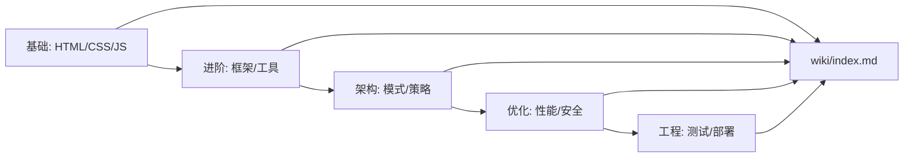

# 前端知识库

<div align="center">

**简体中文** · [English](../README.md)

[](https://github.com/frontend-wiki)
[](./overview.md)

</div>

> 一个系统化的前端知识体系 — 从基础到架构，从工具到哲学。
> **目标不是罗列技术，而是理解前端如何思考、如何演进、如何构建用户界面。**

<div align="center">
  
  
  
  
  
  
</div>

本知识库采用 **Karpathy Wiki 方法**：原始材料经过系统化整理，提炼为高压缩比的概念页面、技术页面和模式页面。[`overview.md`](overview.md) 是最高压缩的综合概述；[`index.md`](index.md) 是完整目录。

> [!IMPORTANT]
> 从 [`overview.md`](overview.md) 开始，而不是直接跳到细节。概述提供了全局视角；索引提供了完整导航。

---

## 快速路径

| 我想… | 从这里开始 |
|---|---|
| 了解全貌 | [overview.md](overview.md) |
| 浏览完整目录 | [index.md](index.md) |
| 掌握核心基础 | [concepts/html-fundamentals.md](concepts/html-fundamentals.md) · [concepts/css-fundamentals.md](concepts/css-fundamentals.md) · [concepts/javascript-fundamentals.md](concepts/javascript-fundamentals.md) |
| 理解现代框架 | [concepts/component-architecture.md](concepts/component-architecture.md) |
| 学习性能优化 | [concepts/web-vitals.md](concepts/web-vitals.md) |
| 掌握工程化 | [concepts/frontend-engineering.md](concepts/frontend-engineering.md) |

---

## 1. 前端是什么

> "前端是用户与数字世界的接口层。"

前端开发不是"写页面"，而是**构建人机交互的媒介**。三个核心维度：

### 1. 技术栈
- **HTML** — 语义化结构，内容模型，可访问性基础
- **CSS** — 视觉表现，布局系统，响应式设计
- **JavaScript** — 交互逻辑，状态管理，动态渲染

### 2. 工程化
- **构建工具** — Vite, Webpack, esbuild, Turbopack
- **包管理** — npm, pnpm, yarn, Bun
- **代码质量** — ESLint, Prettier, TypeScript, Biome
- **测试体系** — Vitest, Jest, Playwright, Cypress

### 3. 架构范式
- **组件化** — React, Vue, Svelte, Angular
- **状态管理** — Redux, Zustand, Pinia, Signals
- **数据流** — REST, GraphQL, tRPC, Server Components
- **渲染模式** — CSR, SSR, SSG, ISR, Streaming SSR

---

## 2. 核心概念框架

前端知识可以压缩为 **七个核心框架**：

| 框架 | 回答的问题 | 关键概念 |
|---|---|---|
| [语义化 HTML](concepts/html-fundamentals.md) | 内容如何被结构化？ | 文档流、ARIA、SEO、可访问性 |
| [CSS 层叠与布局](concepts/css-fundamentals.md) | 样式如何计算与应用？ | 层叠上下文、Flexbox、Grid、容器查询 |
| [JavaScript 运行时](concepts/javascript-fundamentals.md) | 代码如何执行？ | 事件循环、闭包、原型链、模块系统 |
| [组件架构](concepts/component-architecture.md) | UI 如何被分解与组合？ |  Props、状态、生命周期、组合模式 |
| [状态管理](concepts/state-management.md) | 数据如何流动与同步？ | 单向数据流、响应式、不可变性、派生状态 |
| [渲染策略](concepts/rendering-strategies.md) | 内容如何到达用户？ | CSR/SSR/SSG/ISR、水合、流式渲染 |
| [性能指标](concepts/web-vitals.md) | 体验如何被量化？ | LCP、INP、CLS、FCP、TTI |

---

## 3. 现代前端思维模型

### 3.1 声明式 vs 命令式
- **命令式**：告诉浏览器"如何做"（jQuery、原生 DOM 操作）
- **声明式**：告诉浏览器"要什么"（React、Vue、现代 CSS）
- 趋势：从命令式向声明式迁移，但底层仍需理解命令式机制

### 3.2 单向数据流
```
UI = f(state)
```
- 状态是唯一的真相源
- UI 是状态的纯函数投影
- 变更通过事件向上传递，通过 props 向下流动

### 3.3 渐进式增强
- 核心内容无需 JS 即可访问
- 交互功能作为增强层添加
- 优雅降级 vs 渐进增强的哲学差异

### 3.4 岛屿架构 (Islands Architecture)
- Astro、Fresh 等框架的核心理念
- 静态 HTML 为主体，交互式组件作为"岛屿"嵌入
- 减少 JS 负载，提升首屏性能

### 3.5 服务器组件
- React Server Components、Vue Server Components
- 组件可以在服务器端运行，不发送 JS 到客户端
- 重新定义客户端/服务器边界

---

## 4. 技术栈演进

### 4.1 时间线

| 时期 | 特征 | 代表技术 |
|---|---|---|
| 1990s | 静态 HTML | HTML 1-4, CGI |
| 2000s | 动态 Web | AJAX, jQuery, Flash |
| 2010s | 单页应用 | Angular, React, Vue, Webpack |
| 2020s | 全栈前端 | Next.js, Nuxt, Remix, Vite, Server Components |
| 2025+ | AI 辅助前端 | v0, Lovable, Cursor, AI 代码生成 |

### 4.2 范式转移

1. **从页面到应用** — SPA 让前端变成"客户端软件"
2. **从库到框架** — 生态从"选择你的库"到"选择你的框架"
3. **从客户端到全栈** — 前端工程师需要理解服务器、数据库、部署
4. **从手写到 AI 辅助** — AI 生成代码改变开发工作流

---

## 5. 核心主张

贯穿整个知识库的 **11 个核心主张**：

1. **语义化是可访问性的基础** — 没有语义化 HTML，ARIA 只是创可贴
2. **CSS 不是样式表，是布局引擎** — 理解层叠、特异性、布局算法比记属性重要
3. **JavaScript 是运行时，不是语言** — 事件循环、微任务、宏任务决定代码行为
4. **组件是抽象单元，不是文件** — 好的组件设计来自职责单一原则
5. **状态管理是数据流设计** — 不是选择 Redux 还是 Zustand，而是设计数据如何流动
6. **渲染策略决定用户体验** — CSR/SSR/SSG 不是技术选择，是产品选择
7. **性能是功能** — 慢的界面等于坏的界面，Web Vitals 是量化标准
8. **工具链是生产力杠杆** — 好的工具链让开发者专注于业务逻辑
9. **类型安全是重构信心** — TypeScript 不是可选，是现代前端的基础设施
10. **测试是文档的 executable 形式** — 测试描述系统应该如何工作
11. **可访问性不是特性，是基础** — a11y 应该在第一天就考虑，不是最后一天

---

## 6. 知识库结构

| 路径 | 用途 |
|---|---|
| `wiki/concepts/` | 核心概念页面（HTML/CSS/JS/架构/性能） |
| `wiki/techniques/` | 具体技术与实现方法 |
| `wiki/tools/` | 工具链与生态系统 |
| `wiki/patterns/` | 设计模式与最佳实践 |
| `wiki/index.md` | 完整目录 |
| `wiki/overview.md` | 最高压缩的综合概述（本文件） |

**工作流：**



---

## 7. 如何使用

- **作为学习路径** — 从基础概念开始，逐步深入到架构和性能
- **作为参考手册** — 通过索引快速查找特定主题
- **作为面试准备** — 核心概念页面覆盖常见面试问题
- **作为团队规范** — 最佳实践页面可作为团队开发指南

> [!TIP]
> **5 分钟**：阅读本概述，了解全貌
> **30 分钟**：阅读 [HTML/CSS/JS 基础](concepts/html-fundamentals.md) + [组件架构](concepts/component-architecture.md)
> **一天**：按顺序浏览所有核心概念页面

---

## 8. 知识图谱

前端知识不是线性的，而是网状的。以下是核心概念之间的关联：

```
                    ┌─────────────┐
                    │   HTML      │
                    │  语义化结构  │
                    └──────┬──────┘
                           │
                    ┌──────▼──────┐
                    │    CSS      │
                    │  视觉表现    │
                    └──────┬──────┘
                           │
                    ┌──────▼──────┐
                    │ JavaScript  │
                    │  交互逻辑    │
                    └──────┬──────┘
                           │
              ┌────────────┼────────────┐
              │            │            │
       ┌──────▼──────┐ ┌───▼────┐ ┌────▼─────┐
       │   框架       │ │ 工具链  │ │  性能     │
       │ React/Vue   │ │ Vite   │ │  Web Vitals│
       └──────┬──────┘ └───┬────┘ └────┬─────┘
              │            │            │
              └────────────┼────────────┘
                           │
                    ┌──────▼──────┐
                    │   架构       │
                    │  模式/策略   │
                    └─────────────┘
```

---

## 9. 持续更新

前端生态快速演进，本知识库持续更新。

**最后更新**: 2025-05-31

**覆盖范围**: 
- HTML5/CSS3/ES2025 基础
- React 19/Vue 3.5/Svelte 5 现代框架
- Next.js 15/Nuxt 3/Remix 全栈框架
- Vite 6/Turbopack 构建工具
- TypeScript 5.7 类型系统
- Web Vitals 性能指标
- AI 辅助开发工作流
